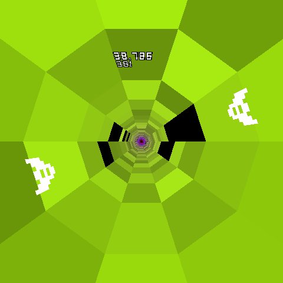

# Parallel Overhead (Web Edition)

Copyright © 2020-2021 ibra-kdbra

**WARNING: This game is visually intensive and has rapidly changing colors.**

Parallel Overhead is a
colorful endless runner game where you take control of the ships Truth and
Beauty on a groundbreaking trip through hyperspace. A stable hyperspace tunnel
has finally been achieved with the two ships on opposite walls of the tunnel.
Well, almost stable...

Parallel Overhead features
[Fast Pulse by oglsdl](https://opengameart.org/content/fast-pulse)
as its soundtrack.

## Playing

This is the web version of the game, which you can

Keep the ships from falling through the holes! The ships can be rotated
clockwise with the left arrow key and anticlockwise with the right arrow key.
The game can be paused/unpaused with space or enter, restarted with backspace
and exited with escape.

The game can also be played with touchscreen taps (or mouse clicks). Tapping
the left quarter of the game will rotate the ships clockwise while tapping the
right quarter will rotate them anticlockwise. Tapping in the middle will pause
or unpause the game.

## Building from source

To make the source code playable, the JS-files in src/ need to be concatenated
into parallel_overhead.js. This can be done with `make`.
